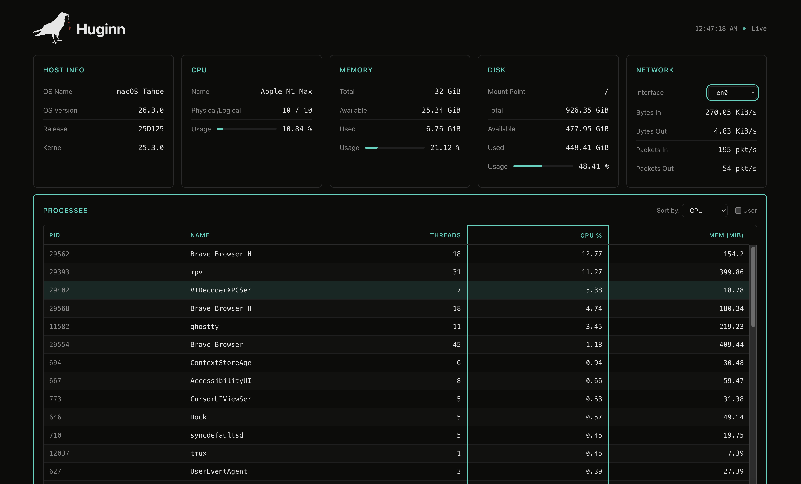
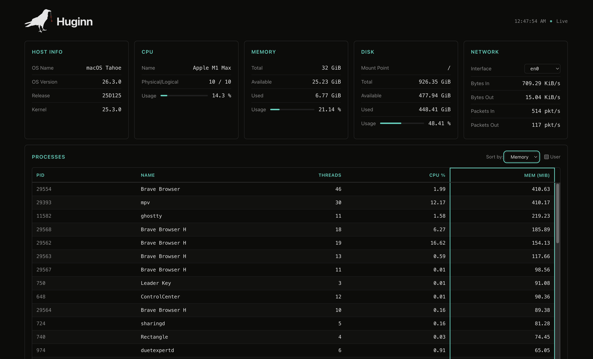

# Huginn

A real-time system monitor for macos and linux, built with Odin. 

The name _Huginn_ is an ode to one of Odin's (Norse mythology) ravens. Huginn
and Muninn (the companion raven) flew across the entire earth and the nine
realms to collect information and return it to Odin.

## Screenshots






## Features

- CPU, memory, disk, and network monitoring
- Process listing with sort by CPU or memory
- Live updating dashboard (no page refresh)
- Native HTML, CSS, and vanilla JS frontend. No frameworks, no npm, no build
  step. The frontend does not modify any data from the OS/Kernel. It simply
  renders the dashboard
- Cross-platform: macOS and Linux

## Prerequisites

- Tested with Odin dev-2026-07a
- Just command runner, optional

## Quick Start

```bash
just -l # list all options
just bd # build debug
just rd # run debug on localhost port 8080
```

Then open http://localhost:8080 in your browser.

## Manual Build

```bash
mkdir -p bin/{debug,release}
odin build server/ -debug -out:bin/debug/huginn
odin build server/ -o:speed -out:bin/release/huginn 
./bin/debug/huginn
```

## Server Configuration and Safety

> SAFETY NOTE: Server Binds to `0.0.0.0:8080` by Default. `server/main.odin:14`
> binds to `net.IP4_Any` (0.0.0.0), which means the server is accessible from
> __all__ network interfaces.

Here is where to make the change to loopback for safety if you prefer:

```odin server/main.odin
/*
Single place to change the server binding.
Default: IP4_Any (0.0.0.0) -- network-accessible.
For localhost-only, change to net.IP4_Loopback.
For a different port, change the port number.
*/
BIND_ENDPOINT :: net.Endpoint {
	address = net.IP4_Any, // change to net.IP4_Loopback
	port    = 8080,        // change to your preferred port
}
```

## API Endpoints

- `GET /`: Dashboard HTML
- `GET /api/host`: OS and kernel info
- `GET /api/metrics`: CPU, memory, disk, network
- `GET /api/processes?sort=cpu|mem`: Top processes

## API Examples

```bash
# Host info
curl http://localhost:8080/api/host

# CPU, memory, disk, network
curl http://localhost:8080/api/metrics

# Top processes
curl http://localhost:8080/api/processes

# Top processes by CPU
curl "http://localhost:8080/api/processes?sort=cpu"

# Top processes by memory
curl "http://localhost:8080/api/processes?sort=mem"
```

All endpoints return JSON. The metrics endpoint updates every 2 seconds and the
processes endpoint every 5 seconds when viewed in the dashboard.

## Architecture

Huginn has three layers:

- `metrics`: Platform-specific system OS/Kernel data collection
- `server`: HTTP server and JSON serialization (uses vendored odin-http library)
- `static`: Frontend dashboard (HTML, CSS, vanilla JS)

The metrics package uses a `sync.Once` for host info caching and a
mutex-protected delta state for CPU and network rate calculations. The server
uses `#load` to embed static files at compile time, so the binary is
self-contained.

## License

MIT. See [LICENSE](./LICENSE) for details.

## Acknowledgements

- Raven icon: "Crow standing with red key 2" from Wikimedia Commons, originally
  from Pixabay (CC0 1.0 Public Domain). Modified by me using Inkscape.
- HTTP server powered by [odin-http](https://github.com/laytan/odin-http)
